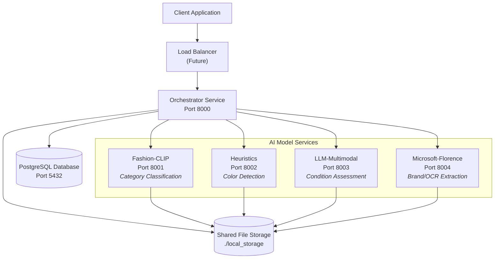
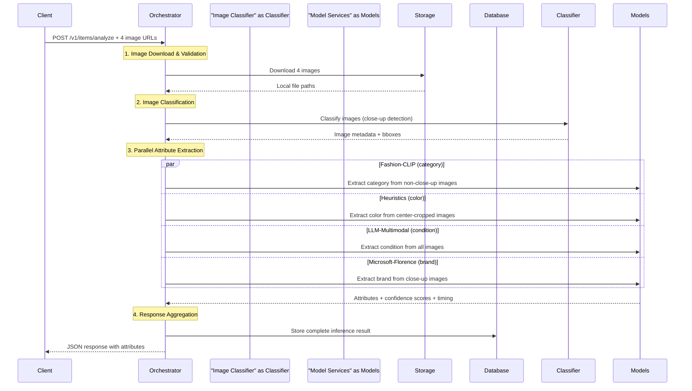
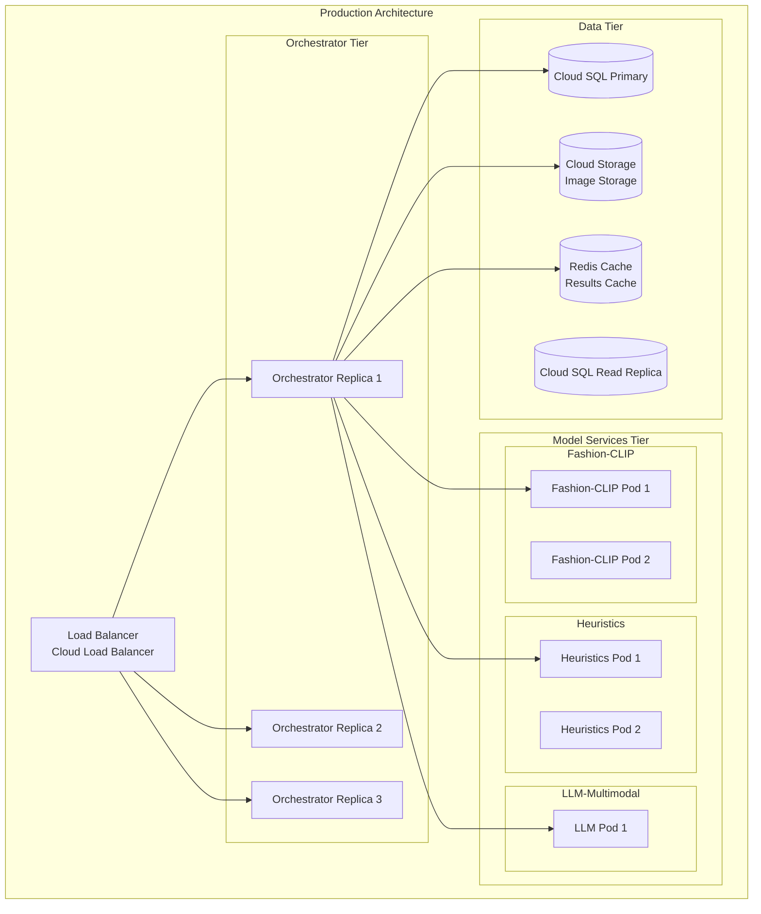

# Smartrobe Architecture

Technical deep-dive into the multi-model attribute extraction microservices system.

## Overview

Smartrobe is a prototype implementing a multi-model AI system for extracting clothing attributes from images. The system demonstrates microservices architecture with parallel processing, intelligent image filtering, and graceful degradation.

## System Architecture

### High-Level Design



**Key Architectural Decisions:**

1. **Orchestrator Pattern:** Single entry point that coordinates all model services
2. **Shared Storage:** Images downloaded once and shared via filesystem (scales to S3/GCS)
3. **Service Independence:** Each model service can be developed, tested, and scaled independently
4. **Async Processing:** Parallel attribute extraction for optimal performance

## Data Flow Architecture

### Request Processing Pipeline



### Image Processing Strategy

**Smart Image Filtering:**
Different models receive different image types based on optimal performance:

- **Close-up images:** Brand detection (text/logos more visible)
- **Non-close-up images:** Category classification (full garment context)
- **Center-cropped images:** Color detection (focus on fabric, avoid background)
- **All images:** Condition assessment (multiple angles provide better assessment)

**File Storage Pattern:**
```
./local_storage/
├── {request_id}/
│   ├── image_0.jpg              # Original downloaded image
│   ├── image_0_center_cropped.jpg  # For color detection
│   ├── image_1.jpg
│   ├── image_1_cropped.jpg      # Garment-only crop
│   ├── ...
│   └── image_metadata.json     # Classification results
```

## Database Design

### Schema

```sql
CREATE TABLE inference_results (
    id UUID PRIMARY KEY,
    request_data JSONB NOT NULL,     -- Original request (image URLs)
    attributes JSONB NOT NULL,       -- Extracted attributes
    model_info JSONB NOT NULL,       -- Per-model performance metadata  
    processing_info JSONB NOT NULL,  -- Overall processing metadata
    created_at TIMESTAMP DEFAULT NOW(),
    updated_at TIMESTAMP DEFAULT NOW()
);

-- Indexes for efficient querying
CREATE INDEX idx_inference_created_at ON inference_results(created_at);
CREATE INDEX idx_inference_attributes ON inference_results USING GIN(attributes);
```

### Data Storage Strategy

**JSONB Benefits:**
- Flexible schema for evolving attribute sets
- Efficient querying with GIN indexes
- Native JSON operations in PostgreSQL
- Easy aggregation and analytics

**Sample Record:**
```json
{
  "id": "550e8400-e29b-41d4-a716-446655440000",
  "request_data": {
    "images": ["https://example.com/shirt1.jpg", "..."]
  },
  "attributes": {
    "category": "shirt",
    "color": "blue", 
    "condition": "good",
    "brand": "nike"
  },
  "model_info": {
    "category": {
      "service_name": "fashion-clip",
      "processing_time_ms": 1200,
      "confidence_score": 0.89,
      "success": true
    }
  }
}
```

## Configuration Management

### Attribute Routing Configuration

The system uses a YAML configuration file to map attributes to services:

```yaml
# config/attribute_routing.yml
attributes:
  # Each attribute specifies:
  # - service: which microservice handles it
  # - image_filter: which images to send (all/close_up/non_close_up)
  
  color: 
    service: heuristics
    image_filter: non_close_up
    
  category: 
    service: fashion-clip  
    image_filter: non_close_up
    
  condition: 
    service: llm-multimodal
    image_filter: all
    
  brand: 
    service: microsoft-florence
    image_filter: close_up

timeouts:
  default: 30
  llm-multimodal: 45        # LLM calls take longer
  microsoft-florence: 90    # OCR processing is slow
```

**Benefits:**
- Easy to add new attributes without code changes
- Service assignment can be optimized based on performance
- Image filtering strategies can be tuned per attribute
- Timeout configuration per service

## Error Handling & Resilience

### Graceful Degradation Strategy

The system is designed to continue processing even when individual services fail:

```python
# If heuristics service fails:
{
  "attributes": {
    "category": "shirt",     # ✅ Fashion-CLIP succeeded
    "color": null,           # ❌ Heuristics failed  
    "condition": "good",     # ✅ LLM succeeded
    "brand": "nike"          # ✅ Florence succeeded
  },
  "model_info": {
    "color": {
      "success": false,
      "error_message": "Service timeout",
      "processing_time_ms": 30000
    }
  }
}
```

### Timeout & Retry Logic

- **Service-specific timeouts:** Different models have different processing times
- **Parallel processing:** Service failures don't block other services
- **Comprehensive logging:** All errors captured with request correlation IDs

## Scalability Considerations

### Current Limitations

1. **File Storage:** Local filesystem doesn't scale across replicas
2. **Single Database:** No read replicas or sharding
3. **No Caching:** Repeated processing of same images
4. **Sequential Image Processing:** Images processed one request at a time

### Production Scaling Strategy



**Scaling Strategies:**

1. **Horizontal Service Scaling:**
   - Scale orchestrator behind load balancer
   - Independent scaling per model service based on processing time
   - GPU nodes for intensive vision models

2. **Data Layer Scaling:**
   - Cloud SQL with read replicas
   - Cloud Storage for image persistence
   - Redis for result caching and rate limiting

3. **Performance Optimization:**
   - Image preprocessing pipeline (resize, format conversion)
   - Model result caching by image hash
   - Batch processing for multiple requests