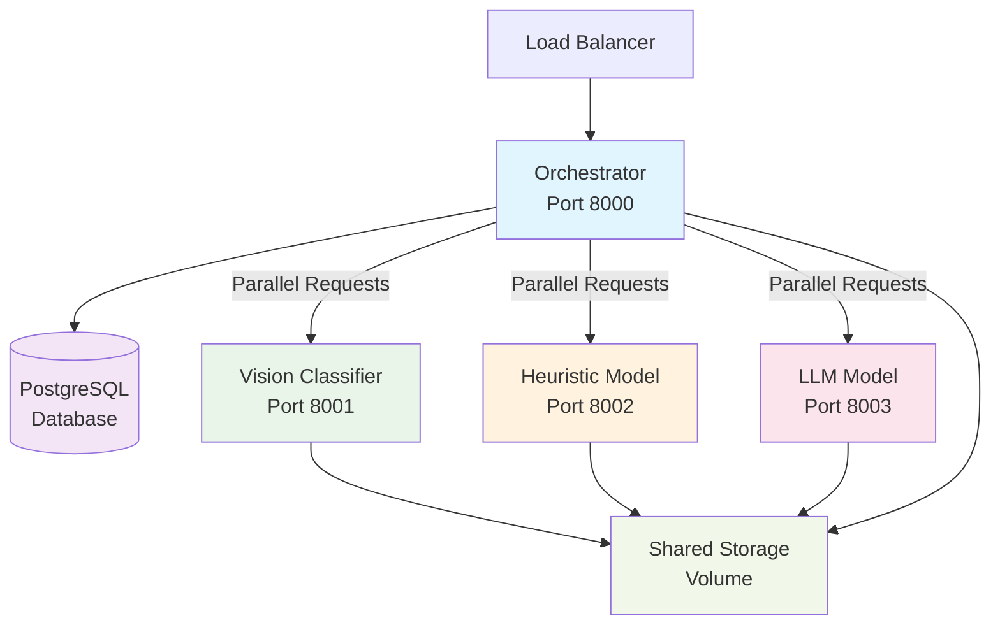
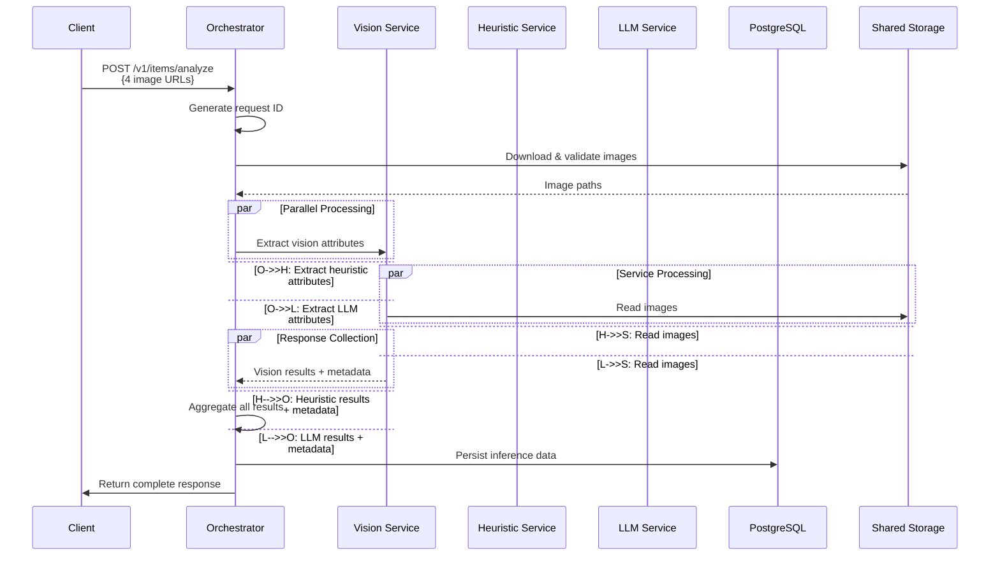

# Smartrobe - Multi-Model Attribute Extraction Service
## Comprehensive Implementation Plan

### Table of Contents
- [Project Overview](#project-overview)
- [Requirements Analysis](#requirements-analysis)
- [Architecture Decisions](#architecture-decisions)
- [Technology Stack](#technology-stack)
- [System Design](#system-design)
- [Implementation Plan](#implementation-plan)
- [Testing Strategy](#testing-strategy)
- [Deployment Strategy](#deployment-strategy)
- [Timeline](#timeline)
- [Risk Mitigation](#risk-mitigation)

---

## Project Overview

### Goal
Build a multi-model attribute extraction service that processes 4 photos of second-hand clothing items and extracts 13 attributes using different model types (vision classifier, heuristic model, LLM).

### Key Features
- **REST API**: Single endpoint for item analysis
- **Multi-Model Architecture**: 3 different model types working in parallel
- **Async Processing**: Parallel attribute extraction for optimal performance
- **Persistence**: Database storage of inference results
- **Containerization**: Docker-based microservices
- **Monitoring**: Health checks and structured logging

---

## Requirements Analysis

### Functional Requirements
1. **API Endpoint**: `POST /v1/items/analyze`
2. **Input**: JSON with exactly 4 HTTPS image URLs (≤10MB each)
3. **Output**: JSON with id, attributes, model_info, processing metadata
4. **Attributes (13 total)**:
   - Vision Classifier: category, gender, sleeve_length, neckline, closure_type, fit
   - Heuristic Model: color, material, pattern, brand
   - LLM Model: style, season, condition
5. **Response Time**: <2-8 seconds target
6. **Persistence**: Store results in database

### Non-Functional Requirements
- **Scalability**: Microservice architecture for independent scaling
- **Reliability**: Partial results on service failures
- **Maintainability**: Clean code, proper error handling, logging
- **Observability**: Health endpoints, structured logging
- **Development**: Modern tooling, type safety, containerization

---

## Architecture Decisions

### 1. **Monorepo + Microservices**
- **Decision**: Single repository with multiple containerized services
- **Rationale**: Easier development/testing while maintaining service isolation
- **Structure**: 4 services (orchestrator + 3 models) with shared code

### 2. **Image Handling Strategy**
- **Decision**: Orchestrator downloads images once, shares via file system
- **Rationale**: Avoid duplicate downloads, centralized validation, better caching
- **Implementation**: Shared Docker volume with request-scoped directories

### 3. **Attribute-Model Mapping**

| Model Type | Attributes | Rationale |
|------------|------------|-----------|
| **Vision Classifier** | category, gender, sleeve_length, neckline, closure_type, fit | Computer vision excels at visual pattern recognition and geometric measurements |
| **Heuristic Model** | color, material, pattern, brand | Rule-based analysis effective for concrete visual properties and OCR/logo detection |
| **LLM Model** | style, season, condition | Subjective assessments requiring contextual understanding and reasoning |

#### Detailed Breakdown:
- **Vision Classifier (6 attributes)**:
  - `category` - Clothing type classification (shirt, pants, dress, etc.)
  - `gender` - Target gender identification (male, female, unisex)
  - `sleeve_length` - Visual measurement (sleeveless, short, long, etc.)
  - `neckline` - Shape detection (crew, v-neck, scoop, etc.)
  - `closure_type` - Visual element detection (button, zip, pullover, etc.)
  - `fit` - Silhouette analysis (slim, regular, loose, oversized, etc.)

- **Heuristic Model (4 attributes)**:
  - `color` - Dominant color analysis using image processing
  - `material` - Texture and surface pattern analysis
  - `pattern` - Geometric pattern detection (solid, striped, floral, etc.)
  - `brand` - Logo and text detection using OCR techniques

- **LLM Model (3 attributes)**:
  - `style` - Aesthetic categorization (casual, formal, sporty, vintage, etc.)
  - `season` - Appropriateness inference (spring, summer, fall, winter)
  - `condition` - Quality assessment (new, like_new, good, fair, poor)

### 4. **Error Handling Strategy**
- **Decision**: Partial results with graceful degradation
- **Rationale**: Better UX, allows for service failures
- **Implementation**: Continue processing even if individual services fail

### 5. **Database Choice**
- **Decision**: PostgreSQL over SQLite
- **Rationale**: More realistic, better concurrency, containerization friendly

---

## Technology Stack

### Core Framework
- **FastAPI**: High-performance API framework with automatic OpenAPI docs
- **PostgreSQL**: Production-ready database with excellent Docker support
- **Docker + docker-compose**: Containerization and orchestration

### Package Management & Code Quality
- **uv**: Fast Python package installer and resolver
- **Ruff**: Lightning-fast linter and formatter (replaces black/isort/flake8)
- **pytest + httpx**: Modern testing framework with async HTTP client
- **pre-commit**: Git hooks for code quality

### Libraries
- **Pydantic**: Type-safe data validation and serialization
- **SQLAlchemy**: Database ORM with async support
- **loguru**: Simple yet powerful structured logging
- **httpx**: Async HTTP client for inter-service communication
- **Pillow**: Image processing and validation

### Development Tools
- **SwaggerUI**: Interactive API testing (built into FastAPI)
- **Multi-stage Docker builds**: Optimized container images

---

## System Design

### Service Architecture



### Data Flow



### Database Schema
```sql
CREATE TABLE inference_results (
    id UUID PRIMARY KEY,
    request_data JSONB NOT NULL,
    attributes JSONB NOT NULL,
    model_info JSONB NOT NULL,
    processing_info JSONB NOT NULL,
    created_at TIMESTAMP DEFAULT NOW(),
    updated_at TIMESTAMP DEFAULT NOW()
);

CREATE INDEX idx_inference_created_at ON inference_results(created_at);
CREATE INDEX idx_inference_attributes ON inference_results USING GIN(attributes);
```

---

## Implementation Plan

### Phase 1: Foundation (2 hours)
#### 1.1 Project Structure Setup (30 min)
- [ ] Create directory structure
- [ ] Initialize `pyproject.toml` with uv workspace
- [ ] Setup `.pre-commit-config.yaml` with ruff
- [ ] Create `.env.example` template
- [ ] Initialize `shared/` module with common utilities

#### 1.2 Shared Components (45 min)
- [ ] Define Pydantic models in `shared/schemas.py`
- [ ] Implement common utilities (logging, config validation)
- [ ] Create base service class template
- [ ] Setup structured logging with loguru

#### 1.3 Database Layer (45 min)
- [ ] Design SQLAlchemy models
- [ ] Create database initialization scripts
- [ ] Implement async database session management
- [ ] Add database health checks

### Phase 2: Core Services (3 hours)
#### 2.1 Orchestrator Service (90 min)
- [ ] Implement FastAPI application structure
- [ ] Add image download and validation logic
- [ ] Create service communication layer (httpx)
- [ ] Implement parallel request handling with asyncio
- [ ] Add response aggregation logic
- [ ] Implement database persistence
- [ ] Add comprehensive error handling

#### 2.2 Vision Classifier Service (30 min)
- [ ] Create FastAPI service template
- [ ] Implement mock vision processing with realistic latencies
- [ ] Add attribute extraction for: category, gender, sleeve_length, neckline, closure_type, fit
- [ ] Include confidence scores and timing metadata
- [ ] Add health endpoint

#### 2.3 Heuristic Model Service (30 min)
- [ ] Implement rule-based processing logic
- [ ] Add mock image analysis for: color, material, pattern, brand
- [ ] Simulate OCR/logo detection capabilities
- [ ] Add timing and confidence metadata
- [ ] Implement health endpoint

#### 2.4 LLM Model Service (30 min)
- [ ] Create LLM integration structure (OpenAI ready)
- [ ] Implement mock responses for: style, season, condition
- [ ] Add realistic response times simulation
- [ ] Implement graceful fallback for API failures
- [ ] Add health endpoint

### Phase 3: Infrastructure (1.5 hours)
#### 3.1 Containerization (60 min)
- [ ] Create multi-stage Dockerfiles for each service
- [ ] Setup docker-compose.yml with PostgreSQL
- [ ] Configure shared volumes for image storage
- [ ] Add environment variable management
- [ ] Setup networking between services

#### 3.2 Configuration & Secrets (30 min)
- [ ] Implement environment-based configuration
- [ ] Add proper secret management (no hardcoded fallbacks)
- [ ] Create development vs production configs
- [ ] Add configuration validation

### Phase 4: Testing & Quality (1 hour)
#### 4.1 Testing Framework (30 min)
- [ ] Setup pytest configuration
- [ ] Create integration test suite
- [ ] Add service health check tests
- [ ] Implement end-to-end API tests

#### 4.2 Code Quality (30 min)
- [ ] Configure ruff for consistent formatting
- [ ] Setup pre-commit hooks
- [ ] Add type checking with mypy (optional)
- [ ] Create test coverage reporting

### Phase 5: Documentation & Polish (30 min)
- [ ] Create comprehensive README.md
- [ ] Write ARCHITECTURE.md with system diagrams
- [ ] Document API usage examples
- [ ] Add AI_USAGE.md
- [ ] Create deployment instructions

---

## Testing Strategy

### Development Testing
1. **SwaggerUI**: Interactive API testing at `http://localhost:8000/docs`
2. **Health Checks**: Monitor service availability at `/health` endpoints
3. **Logs**: Real-time monitoring with structured JSON logs

### Automated Testing
```python
# Integration test example
async def test_analyze_endpoint():
    async with httpx.AsyncClient() as client:
        response = await client.post(
            "http://localhost:8000/v1/items/analyze",
            json={"images": [TEST_IMAGE_URLS]}
        )
        assert response.status_code == 200
        assert "attributes" in response.json()
        assert len(response.json()["attributes"]) == 13
```

### Test Data
- Use public placeholder images (e.g., placeholder.com, unsplash.com)
- Create test cases for various error scenarios
- Validate response schemas with Pydantic

---

## Deployment Strategy

### Local Development
```bash
# Start all services
docker-compose up --build

# Test API
curl -X POST "http://localhost:8000/v1/items/analyze" \
  -H "Content-Type: application/json" \
  -d '{"images": ["https://picsum.photos/600/400"]}'
```

### Production Considerations (for Part B)
- **GCP Cloud Run**: Serverless container deployment
- **GKE**: Kubernetes for complex scaling requirements
- **Cloud SQL**: Managed PostgreSQL
- **Cloud Storage**: Image caching and storage
- **Cloud Monitoring**: Structured logging and metrics

---

## Timeline

| Phase | Duration | Deliverables |
|-------|----------|-------------|
| Foundation | 2h | Project structure, schemas, database |
| Core Services | 3h | 4 working microservices |
| Infrastructure | 1.5h | Docker setup, configuration |
| Testing & Quality | 1h | Tests, linting, validation |
| Documentation | 0.5h | README, architecture docs |
| **Total** | **8h** | **Complete working system** |

---

## Risk Mitigation

### Technical Risks
1. **Service Communication Failures**
   - Mitigation: Implement timeouts, retries, circuit breakers
   - Fallback: Return partial results with error flags

2. **Image Download/Processing Issues**
   - Mitigation: Validate URLs, file size limits, format checking
   - Fallback: Skip invalid images, process remaining

3. **Database Connection Issues**
   - Mitigation: Connection pooling, health checks
   - Fallback: Continue processing, queue for later persistence

### Timeline Risks
1. **Scope Creep**: Focus on MVP, document enhancement opportunities
2. **Technical Complexity**: Use mocks effectively, avoid over-engineering
3. **Environment Issues**: Provide clear setup instructions, docker consistency

### Quality Risks
1. **Code Quality**: Automated linting, type checking
2. **Testing Coverage**: Focus on critical paths, integration testing
3. **Documentation**: Write as you build, not at the end

---

## Success Criteria

### Functional
- ✅ Working API endpoint with 13 attribute extraction
- ✅ 3 model types processing in parallel
- ✅ Database persistence of results
- ✅ Docker containerization with docker-compose

### Technical
- ✅ <2-8 second response times
- ✅ Graceful error handling
- ✅ Structured logging and monitoring
- ✅ Type-safe code with Pydantic

### Documentation
- ✅ Clear setup and usage instructions
- ✅ Architecture documentation with diagrams
- ✅ API documentation (SwaggerUI)
- ✅ AI usage transparency

---

*This plan serves as our north star for implementation. Each phase builds upon the previous, ensuring we deliver a working system within the 8-hour timeframe while maintaining high code quality and proper architecture.*
