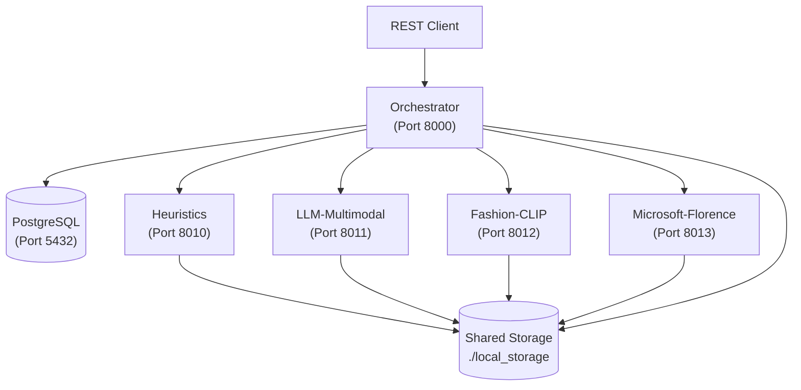
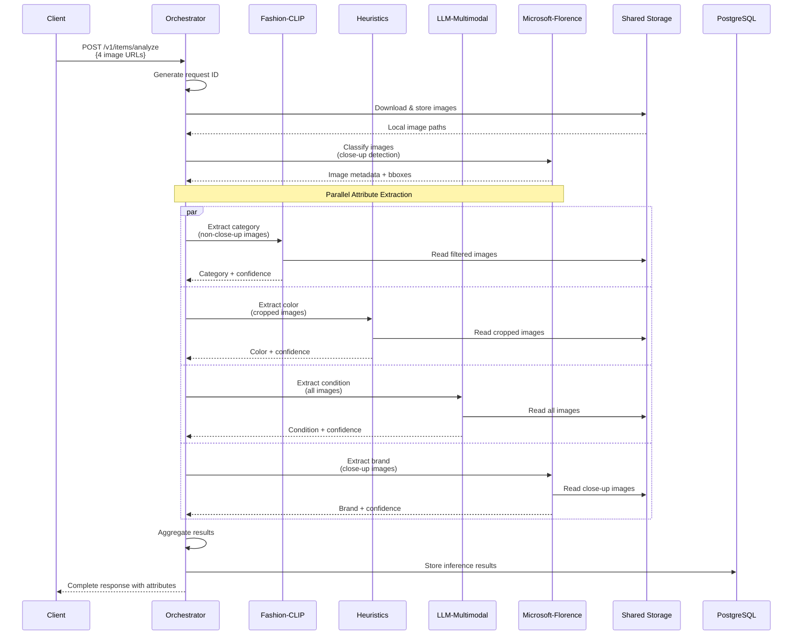

# 🧥 Smartrobe - Multi-Model Attribute Extraction Service

A microservices prototype for extracting clothing attributes from images using multiple models.

## 🎯 What It Does

Smartrobe takes 1-4 clothing photos and extracts attributes using different model types, for example:

- **Fashion-CLIP**: Category classification (vision model)
- **Heuristics**: Color detection using clustering and color mapping (rule-based)  
- **LLM-Multimodal**: Condition assessment using OpenAI GPT-4o
- **Microsoft-Florence**: Image classification (close-up vs entire garment) and brand extraction via OCR (vision model)

### Current Status

**✅ What's Working:**
- Full microservices architecture with Docker
- Smart image classification (close-up vs entire garment)
- 4 out of 13 attributes implemented: `color`, `category`, `condition`, `brand`
- Parallel processing with graceful error handling
- PostgreSQL persistence with JSONB storage
- Comprehensive logging and health checks

**⚠️ What's Missing:**
- 9 remaining attributes (gender, sleeve_length, neckline, closure_type, fit, material, pattern, style, season)
- Production-ready error handling
- Authentication/authorization?
- Rate limiting
- Performance optimization, better concurrency handling
- Using cloud storage instead of local filesystem, e.g. S3 or GCS

## 🏗️ Architecture

5 containerized services with shared file storage:



### Data Flow

Smart image processing with parallel attribute extraction:



**Key Design Features:**
- **Smart Image Filtering:** Different models get different image types (close-up vs full-garment)
- **Parallel Processing:** All attribute extractions happen simultaneously  
- **Graceful Degradation:** System continues if individual services fail
- **Single Download:** Images downloaded once, shared via filesystem

## 🚀 Setup & Run

### Prerequisites

- Docker & Docker Compose
- Enough RAM (AI models are memory-hungry)
- Ports 8000, 8010-8013 and 5432 free
- OpenAI API key (for LLM service)

### Environment Setup

Create `.env` file with required variables:

```bash
# Copy example template
cp .env.example .env

# Add your OpenAI API key, configure what you need in the .env file
```

### Start Services

```bash
# Build and start all containers
docker compose up --build

# Or run in background
docker compose up --build -d

# Check all services are healthy
curl http://localhost:8000/health
```

**Startup time:** can be up to ~2-3 minutes (downloading AI models)

### Test with Real Data

In the folder `test-images/`, there are some sample clothing images.
You can place there more, follow this structure:
```
test-images/
├── 01/
│   ├── image1.jpg  # Downloaded image based on the URLs in the urls.txt file (optional)
│   ├── image2.jpg  # Downloaded image based on the URLs in the urls.txt file (optional)
│   ├── image3.jpg  # Downloaded image based on the URLs in the urls.txt file (optional)
│   ├── image4.jpg  # Downloaded image based on the URLs in the urls.txt file (optional)
│   └── urls.txt    # List of image URLs
├── 02/
│   └── ...
└── ...
```

Folders can have any arbitrary name, but they must contain a `urls.txt` file with the list of image URLs.


Then you can test the API with the `scripts/test_analyze.py` script:

```bash
# Sync dependencies
uv sync

# Syntax
uv run python scripts/test_analyze.py <folder_name>

# Help
uv run python scripts/test_analyze.py --help

# Test with clothing images from test-images/03/
uv run python scripts/test_analyze.py 03
```

## 📋 API Reference

### Main Endpoint

**POST** `/v1/items/analyze`

```bash
curl -X POST "http://localhost:8000/v1/items/analyze" \
  -H "Content-Type: application/json" \
  -d '{
    "images": [
      "https://example.com/shirt1.jpg",
      "https://example.com/shirt2.jpg"
    ]
  }'
```

**Requirements:**
- 1-4 HTTPS URLs only
- JPEG/PNG/WebP formats
- ≤10MB per image

**Response:** JSON with extracted attributes (only implemented ones have values):

```json
{
  "id": "550e8400-e29b-41d4-a716-446655440000",
  "attributes": {
    "category": "shirt",     // ✅ Fashion-CLIP  
    "color": "blue",         // ✅ Heuristics
    "condition": "good",     // ✅ LLM-Multimodal
    "brand": "Nike",         // ✅ Microsoft-Florence
    
    // Not implemented yet (return null)
    "gender": null,
    "sleeve_length": null,
    "neckline": null,
    "closure_type": null,
    "fit": null,
    "material": null,
    "pattern": null,
    "style": null,
    "season": null
  },
  "model_info": {
    "category": {
      "service_name": "fashion-clip",
      "processing_time_ms": 1200,
      "confidence_score": 0.89,
      "success": true
    }
    // ... other model info
  },
  "processing": {
    "total_processing_time_ms": 3500,
    "image_count": 2,
    "implemented_attributes": ["category", "color", "condition", "brand"],
    "skipped_attributes": ["gender", "sleeve_length", ...]
  }
}
```

**Other Endpoints:**
- `GET /health` - Service health check
- `GET /docs` - Interactive API documentation

## 🧪 Testing

### Development Testing

```bash
# Health checks for all services
curl http://localhost:8000/health  # Orchestrator
curl http://localhost:8010/health  # Heuristics
curl http://localhost:8011/health  # LLM-Multimodal
curl http://localhost:8012/health  # Fashion-CLIP
curl http://localhost:8013/health  # Microsoft-Florence

# Test with sample clothing images
uv run python scripts/test_analyze.py 03

# Monitor logs during testing
docker compose logs -f orchestrator
```

### Troubleshooting

**Services won't start:**
```bash
docker compose down -v  # Reset everything
docker system prune     # Clean Docker cache
docker compose up --build
```

**Slow responses/timeouts:**
- Check Docker memory allocation (may eat a lot of RAM)
- Monitor logs: `docker compose logs service-name`
- Some AI models download on first run (patience required)

## 🔧 Development

### Project Structure

```
smartrobe/
├── services/
│   ├── orchestrator/      # Main API service (routes requests)
│   ├── fashion-clip/      # Pretrained vision classifier  
│   ├── heuristics/        # Rule-based analysis (color detection)
│   ├── llm-multimodal/    # LLM reasoning (OpenAI GPT-4V)
│   └── microsoft-florence/ # OCR/brand detection
├── shared/                # Common utilities, schemas, DB models
├── scripts/               # Testing utilities
├── test-images/           # Sample clothing images  
├── config/                # Attribute routing configuration
└── compose.yml            # Docker orchestration
```

### Original Task Context

**✅ Completed:**
- Microservices architecture (orchestrator + 4 model services)
- Docker containerization with `docker compose`
- 3+ model types: vision classifier, heuristic model, LLM
- REST API: `POST /v1/items/analyze`
- JSON input/output with metadata
- Structured logging and health endpoints
- PostgreSQL persistence

**📋 Original Goal:** 13 attributes extracted from exactly 4 images
**🎯 Current Status:** 4/13 attributes implemented (proof of concept)

### Adding More Attributes

To complete the original 13-attribute goal:

1. **Update routing config:** `config/attribute_routing.yml`
2. **Implement in services:** Add extraction logic to appropriate service
3. **Update schemas:** Add new enums in `shared/schemas.py`
4. **Test:** Use `uv run python scripts/test_analyze.py` to verify

## 🚀 Production Deployment Considerations

When moving SmartRobe to production, there are several key decisions and considerations to keep in mind:

### Deployment Strategy Options

**Serverless Approach (Cloud Run/Lambda)**
- Best for: Variable traffic, cost optimization, minimal ops overhead
- Considerations: Cold starts may affect response times for AI models
- Good fit when: Usage is unpredictable or you want to minimize infrastructure management

**Container Orchestration (Kubernetes/ECS)**
- Best for: High-volume, consistent traffic, need for fine-grained control
- Considerations: Requires more operational expertise and setup complexity
- Good fit when: You have dedicated DevOps resources and predictable high traffic

### Key Production Considerations

**Data Storage & Management**
- Replace local file storage with cloud storage (S3, Cloud Storage, etc.)
- Use managed database services for reliability and automated backups
- Consider CDN for image delivery to improve global performance
- Plan for data retention policies and GDPR compliance

**Scalability & Performance**
- AI model inference can be resource-intensive - consider GPU instances for heavy models
- Image processing may require significant memory - plan instance sizing accordingly
- Implement proper caching strategies for frequently accessed data
- Consider async processing for non-real-time operations

**Security & Compliance**
- Secure API endpoints with proper authentication
- Encrypt sensitive data in transit and at rest
- Implement proper access controls for different service components
- Regular security audits and dependency updates

**Monitoring & Observability**
- Set up comprehensive logging for debugging and performance analysis
- Monitor key metrics: response times, error rates, resource utilization
- Implement alerting for critical failures and performance degradation
- Track business metrics: successful analyses, user satisfaction

**Cost Management**
- Monitor cloud costs, especially for AI model inference
- Consider reserved instances for predictable workloads
- Implement auto-scaling to match demand
- Regular cost optimization reviews

## 📋 Design Trade-offs

### What Worked Well
- **Microservices:** Easy to develop/test different models independently
- **Shared Storage:** Avoids duplicate image downloads, enables image filtering
- **Configuration-Driven:** Easy to add new attributes via `config/attribute_routing.yml`
- **Parallel Processing:** Significant performance gains from concurrent extraction

### What Could Be Better
- **Storage:** File system storage doesn't scale (needs S3/GCS in production)
- **Error Handling:** Could be more sophisticated (retry logic, circuit breakers)
- **Model Loading:** Cold starts slow (models download on first run)
- **Testing:** More comprehensive integration tests needed

## 🪜 Next Steps

**Next Steps to Complete 13 Attributes:**
1. Implement remaining 9 attributes across services:
   - `gender`, `sleeve_length`, `neckline`, `closure_type`, `fit` → Fashion-CLIP
   - `material`, `pattern` → Heuristics  
   - `style`, `season` → LLM-Multimodal
2. Implement rate limiting and authentication
3. Add comprehensive error handling and retries
4. Performance optimization, improved concurrency handling and caching

**Disclaimer:** What's Definitely Missing:
- Production-grade error handling and monitoring
- Proper authentication/authorization
- Rate limiting and request validation
- Comprehensive test coverage
- Performance optimization for high throughput